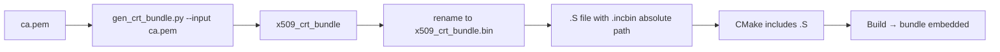

# ESP‑IDF Certificate Bundle Configuration

## Method 1: Manual Assembly + Pre‑generated Binary Bundle

### 1. Generate the binary bundle

Run the script from the folder where you keep your PEM files (e.g., `sharedIncludes`):

```powershell
cd D:\MyStuff\Software\VSrepos\sharedIncludes
python $IDF_PATH/components/mbedtls/esp_crt_bundle/gen_crt_bundle.py --input ca.pem
```

> **Important**: The script has **no `--output` option**. It always creates a file named `x509_crt_bundle` in the current directory. You may rename it to `x509_crt_bundle.bin` for clarity.

### 2. Create the assembly wrapper (`x509_crt_bundle.S`)

Place this file in the same folder (or reference it by absolute path):

```asm
.section .rodata
.global _binary_x509_crt_bundle_start
.global _binary_x509_crt_bundle_end
.align 4

_binary_x509_crt_bundle_start:
    .incbin "D:/MyStuff/Software/VSrepos/sharedIncludes/x509_crt_bundle.bin"
_binary_x509_crt_bundle_end:
```

> Use an **absolute path** to the binary file to avoid “file not found” errors. The assembler looks in the build directory by default.

### 3. Include the assembly file in `CMakeLists.txt`

```cmake
idf_component_register(
    SRCS "main.cpp" "$ENV{ESP_HEADERS}/x509_crt_bundle.S"
    ...
)
```

### 4. Kconfig settings (in `sdkconfig.defaults` or a fragment)

```ini
CONFIG_MBEDTLS_CERTIFICATE_BUNDLE=y
CONFIG_MBEDTLS_CUSTOM_CERTIFICATE_BUNDLE=y
CONFIG_MBEDTLS_CERTIFICATE_BUNDLE_DEFAULT_NONE=y
# DO NOT set CONFIG_MBEDTLS_CUSTOM_CERTIFICATE_BUNDLE_PATH
```

### 5. Clean and rebuild

```powershell
python tools/merge_fragments.py   # if you use a fragment merger
Remove-Item .\sdkconfig -Force
idf.py fullclean
idf.py build
```

### Expected Result

- Flash Data (`.rodata`) drops from ~172 KB to ~103 KB.
- Total image size: ~780 KB.
- MQTTS connects using your custom CA.

## Method 2: Direct PEM Folder (Build‑time Generation)

If you prefer not to manually generate the binary, point the build system to a folder containing your PEM file(s):

```ini
CONFIG_MBEDTLS_CERTIFICATE_BUNDLE=y
CONFIG_MBEDTLS_CERTIFICATE_BUNDLE_DEFAULT_NONE=y
CONFIG_MBEDTLS_CUSTOM_CERTIFICATE_BUNDLE=y
CONFIG_MBEDTLS_CUSTOM_CERTIFICATE_BUNDLE_PATH="main/certs"
```

Place `ca.pem` (and any other `.pem` files) inside `main/certs`. The build will run `gen_crt_bundle.py` automatically.

## Troubleshooting

| Error | Likely Cause | Solution |
|-------|--------------|----------|
| `esp_crt_bundle.h: No such file` | `CONFIG_MBEDTLS_CERTIFICATE_BUNDLE=n` | Set to `y` |
| `file not found: x509_crt_bundle.bin` | Missing binary or wrong path in `.incbin` | Use absolute path |
| `gen_crt_bundle.py --input -q` | Custom bundle path set but empty/invalid | Remove `CONFIG_MBEDTLS_CUSTOM_CERTIFICATE_BUNDLE_PATH` |
| `undefined symbols _binary_x509_crt_bundle_...` | `.S` file not compiled or `.incbin` wrong | Verify `CMakeLists.txt` includes the `.S` |

## Flowchart

