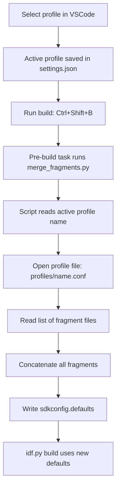

# Using ESP‑IDF SDKconfig Fragments with VSCode Profiles

## Overview

This workflow lets you toggle ESP‑IDF build options (optimisation, mesh, IPv6, logging, mbedTLS features, etc.) by **editing plain text files** and **switching profiles** in VSCode – no `menuconfig` required.

You maintain:
- **Fragment files** – each contains a set of `CONFIG_*` lines (e.g. `opt_size.conf`, `no_mesh.conf`).
- **Profile files** – each lists which fragments to include (e.g. `debug.conf`, `production.conf`).
- A **Python script** that reads the active VSCode profile, assembles the listed fragments, and writes `sdkconfig.defaults`.
- A **VSCode task** that runs the script before every build.

---

## How It Works – Mermaid Flow



---

## Example Profile and Fragment Structure

### Profile file `profiles/debug.conf`
```ini
base.conf
opt_size.conf
log_debug.conf
# mesh.conf       # disabled by commenting
ipv6.conf
```

### Profile file `profiles/production.conf`
```ini
base.conf
opt_size.conf
log_error.conf
no_mesh.conf
no_ipv6.conf
mbedtls_min.conf
```

### Fragment `sdkconfig_fragments/log_debug.conf`
```ini
CONFIG_LOG_DEFAULT_LEVEL=4
CONFIG_LOG_COLORS=y
```

### Fragment `sdkconfig_fragments/log_error.conf`
```ini
CONFIG_LOG_DEFAULT_LEVEL=3
CONFIG_LOG_COLORS=n
```

### Fragment `sdkconfig_fragments/no_mesh.conf`
```ini
CONFIG_ESP_WIFI_MESH_SUPPORT=n
```

---

## Step‑by‑Step Usage

1. **Create the folder structure**
   - `sdkconfig_fragments/` – store all your fragment files.
   - `profiles/` – store your profile files (one per configuration).

2. **Define your fragments**
   Create a fragment for every logical group of settings (e.g. optimisation, logging level, mesh, IPv6, mbedTLS).
   Name them clearly, e.g. `opt_size.conf`, `mesh.conf`, `no_mesh.conf`, `ipv6.conf`, `no_ipv6.conf`.

3. **Define your profiles**
   Each profile file is a simple list of fragment file names (one per line).
   Comment out a line with `#` to exclude that fragment.
   Example:
   - `debug.conf` – includes `log_debug.conf`, `ipv6.conf`, but not `mesh.conf`.
   - `production.conf` – includes `log_error.conf`, `no_ipv6.conf`, `no_mesh.conf`, `mbedtls_min.conf`.

4. **Place the Python script** (`merge_fragments.py`) in your project root.
   The script reads the active profile name from `.vscode/settings.json` (key `idf.activeProfile`), then concatenates the listed fragments into `sdkconfig.defaults`.

5. **Create a VSCode task** (in `.vscode/tasks.json`) that runs `merge_fragments.py` before the build command.

6. **Switch profiles** via the ESP‑IDF Explorer → Project Configuration → Profiles.
   Then build (`Ctrl+Shift+B`). The script runs automatically and rebuilds with the new settings.

---

## Automatic `sdkconfig` Regeneration – Hash‑Based Optimisation

The `merge_fragments.py` script includes a **hash‑based optimisation** to avoid unnecessary full rebuilds:

- The script computes an **MD5 hash** of the aggregated `sdkconfig.defaults` content.
- This hash is stored in `.sdkconfig_defaults.hash` in the project root.
- **Only when the hash changes** (i.e., fragments or profile selection have been modified) will the script:
  - Overwrite `sdkconfig.defaults`
  - Delete the existing `sdkconfig` file to force a full re‑configuration.
- If the hash is unchanged, the script does **nothing** – leaving `sdkconfig` intact and allowing `idf.py` to perform an **incremental build**.

**Result**: Fast iteration times when you are only changing application code, while still guaranteeing that configuration changes are applied reliably.

---

## Toggling Features – Practical Example

Suppose you want to **disable ESP‑MESH** only for your production build.

- Create fragment `sdkconfig_fragments/no_mesh.conf` with:
  ```ini
  CONFIG_ESP_WIFI_MESH_SUPPORT=n
  ```
- In `profiles/production.conf`, uncomment (or add) the line `no_mesh.conf`.
- In `profiles/debug.conf`, either leave it commented or do not include it.
- Switch to `production` profile and build – mesh is disabled. Switch back to `debug` – mesh remains enabled.

---

## Benefits

| Feature | How it helps |
|---------|---------------|
| **No menuconfig** | All settings are in text files, version‑controllable. |
| **Fast toggling** | Comment/uncomment a line in a profile. |
| **Profile‑aware** | Different configurations for debug, production, or different chips. |
| **Fully integrated** | Works inside VSCode with one click build. |
| **Clean separation** | Base settings, optimisation, logging, and hardware features each in their own fragment. |

---

## Common Fragments to Start With

| Fragment | Effect |
|----------|--------|
| `opt_size.conf` | Enables `-Os`, disables asserts, reduces logging level to error. |
| `no_mesh.conf` | Disables ESP‑MESH (large size saving). |
| `no_ipv6.conf` | Disables IPv6 in LWIP. |
| `mbedtls_min.conf` | Disables unused ciphers, ECDH, PSA crypto. |
| `log_error.conf` | Sets log level to error only. |
| `log_debug.conf` | Sets log level to verbose (for debugging). |

Combine them in different ways per profile to get exactly the firmware size and feature set you need.

---

## 🔍 IRAM Usage on ESP32‑S3 – What You Need to Know

### “100% IRAM full” is Normal and Expected

Running `idf.py size-components` on any ESP‑IDF project (even the simplest `hello_world`) typically shows:

```
IRAM                │        16384 │    100.0 │              0 │         16384 │
```

**This is not a problem.** The 16 KB IRAM region is a fixed hardware memory block that contains:
- The interrupt vector table (`.vectors`)
- Core FreeRTOS functions
- Essential HAL (Hardware Abstraction Layer) and startup code
- (If Wi‑Fi is enabled) time‑critical Wi‑Fi driver functions

Even the official ESP‑IDF Wi‑Fi station example reports exactly the same 100% usage. This is by design – the IRAM is fully statically allocated at build time.

### DRAM (DIRAM) – The Real Resource to Monitor

The ESP32‑S3 has a separate DRAM region (over 340 KB) for data, heap, and stacks. When you see 100% IRAM, it does **not** reduce available DRAM. Focus on DRAM usage:

- Low DRAM usage (< 50%) => plenty of headroom for normal operation, OTA, and future features.
- High DRAM usage (> 85%) => you may need to optimise (reduce static buffers, lower stack sizes, move large arrays to PSRAM).

### When Should You Worry About IRAM?

Only if:
1. You add custom interrupt handlers or other code that must be placed in IRAM (using `IRAM_ATTR`) – you may need to remove other IRAM‑resident features.
2. You see a build error: `region 'iram0_0_seg' overflowed by ... bytes` – then you have genuinely exceeded the limit. In that rare case, consider disabling some Wi‑Fi features (e.g., `CONFIG_ESP_WIFI_IRAM_OPT=n`) to free IRAM.

**Do not attempt to increase IRAM size via linker script modifications** – the 16 KB is a hardware limit, and overriding it can cause crashes or memory corruption.

### Conclusion

- **100% IRAM usage is safe and expected** on ESP32‑S3 with default settings.
- Monitor DRAM usage instead.
- Your project is healthy; the “red alert” about IRAM was a misconception.

For further flash size optimisation (reducing `.text` and `.rodata`), refer to the companion guide on disabling unused components, reducing log levels, and trimming LVGL fonts.