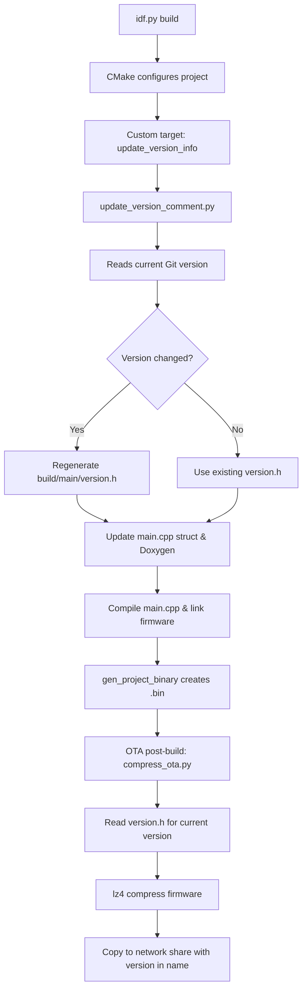
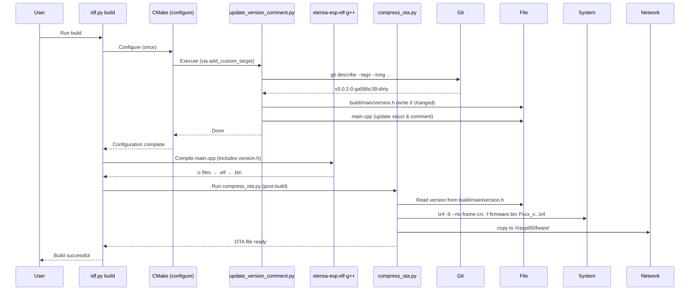

# Firmware Version Automation for ESP‑IDF

This system automatically injects Git version information into your firmware (`main.cpp`) and generates an OTA‑ready compressed binary with the version embedded in its filename. It runs on every `idf.py build` and requires no manual steps after a Git tag change.

## Overview



## File Structure

```text
project/
├── CMakeLists.txt                 # Top‑level (runs scripts)
├── main/
│   ├── CMakeLists.txt             # Component registration
│   └── main.cpp                   # Contains version struct & Doxygen comment
├── tools/
│   ├── update_version_comment.py  # Updates version.h and main.cpp
│   └── compress_ota.py            # Compresses firmware, names with version
└── build/
    └── main/
        └── version.h              # Auto‑generated macros (FW_GIT_VERSION, etc.)
```

## How It Works

1. **Version header generation**
   `update_version_comment.py` runs on every build (via `add_custom_target(update_version_info ALL)`). It:
   - Gets the current Git version with `git describe --tags --long --dirty --always`.
   - Compares it to the version stored in `build/main/version.h`.
   - If different, writes a new `version.h` with macros `FW_GIT_VERSION`, `FW_GIT_TAG`, `FW_GIT_HASH`, `FW_FULL_HASH`, `FW_BUILD_ID`.
   - Then reads the (now up‑to‑date) `version.h` and updates `main.cpp`:
     - Inserts `namespace ED_SYSINFO { struct GIT_fwInfo { ... } }` if missing.
     - Updates the static `constexpr` fields inside that struct.
     - Updates the Doxygen comment block (`@file`, `@brief`, `@author`, `@version`, `@date`, `@submodules-start/end`).

2. **Compilation**
   The compiler sees the freshly written `version.h` (included via `INCLUDE_DIRS` in `main/CMakeLists.txt`) and the updated `main.cpp`. The firmware binary is built as usual.

3. **Post‑build OTA compression**
   After the binary is created, the `gen_project_binary` target triggers `compress_ota.py`. It:
   - Reads the version string from `build/main/version.h`.
   - Compresses the `.bin` file using `lz4` (fast, high compression, no frame CRC).
   - Copies the compressed file to a network share (e.g., `//raspi00/fware`) with a name like `Pxxx_v0.0.2-0-ga58bc39-dirty.bin.lz4`.

## Mermaid Sequence Diagram



## Required Files

### 1. `tools/update_version_comment.py`
Full script (400+ lines) – handles Git detection, version header generation, `main.cpp` struct injection, Doxygen comment update, and submodule version listing.

### 2. `tools/compress_ota.py`
```python
#!/usr/bin/env python3
import os, re, sys, subprocess, shutil

def get_version_from_header(version_h_path):
    if not os.path.isfile(version_h_path): return None
    with open(version_h_path, 'r', encoding='utf-8') as f:
        for line in f:
            m = re.match(r'^#define\s+FW_GIT_VERSION\s+"(.*)"', line)
            if m: return m.group(1)
    return None

def main():
    if len(sys.argv) < 4:
        print("Usage: compress_ota.py <project_name> <firmware_bin> <shared_folder>")
        sys.exit(1)
    project_name, fw_bin, shared_folder = sys.argv[1:4]
    version_h = os.path.join(os.path.dirname(os.path.dirname(os.path.abspath(__file__))), "build", "main", "version.h")
    version = get_version_from_header(version_h) or "v0.0.0-0"
    safe_version = re.sub(r'[/\\]', '_', version)
    compressed_fw = f"{project_name}_{safe_version}.bin.lz4"
    lz4_path = shutil.which("lz4")
    if not lz4_path:
        print("ERROR: lz4 not found"); sys.exit(1)
    subprocess.run([lz4_path, "-9", "--no-frame-crc", "-f", fw_bin, compressed_fw], check=True)
    dest_path = os.path.join(shared_folder, compressed_fw)
    shutil.copy2(compressed_fw, dest_path)
    print(f"Copied to {dest_path}")

if __name__ == "__main__":
    main()
```

### 3. Top‑level `CMakeLists.txt` (relevant snippets)

```cmake
# After project() call
find_package(Python3 REQUIRED)

add_custom_target(
    update_version_info ALL
    COMMAND ${Python3_EXECUTABLE} ${CMAKE_SOURCE_DIR}/tools/update_version_comment.py
    WORKING_DIRECTORY ${CMAKE_SOURCE_DIR}
    COMMENT "Updating Git version in main.cpp and version.h"
    VERBATIM
)

add_dependencies(${CMAKE_PROJECT_NAME}.elf update_version_info)

# OTA post‑build
if(ENABLE_OTA)
    add_custom_command(
        TARGET gen_project_binary
        POST_BUILD
        COMMAND ${Python3_EXECUTABLE} ${CMAKE_SOURCE_DIR}/tools/compress_ota.py
            "${PROJECT_NAME}" "${FW_BIN}" "${SHARED_FOLDER}"
        COMMENT "Compressing firmware with lz4 and copying to shared folder"
        VERBATIM
    )
endif()
```

### 4. `main/CMakeLists.txt` (component registration)

```cmake
idf_component_register(SRCS "main.cpp" "$ENV{ESP_HEADERS}/x509_crt_bundle.S"
    INCLUDE_DIRS "." ${CMAKE_CURRENT_BINARY_DIR}
    REQUIRES ED_WIFI ED_MQTT diag ED_S_JSON ED_OTA
)

target_compile_definitions(${COMPONENT_TARGET} PRIVATE ENABLE_OTA=${ENABLE_OTA})
```

## Usage

1. Place the scripts in `tools/`.
2. Replace your `CMakeLists.txt` files with the snippets above.
3. Run `idf.py fullclean reconfigure build`.
4. Every subsequent `idf.py build` will automatically:
   - Update the Git version in `version.h` and `main.cpp` if the tag changed.
   - Produce an OTA compressed file named `PROJECT_NAME_VERSION.bin.lz4` in the shared folder.

## Troubleshooting

- **Version not updating**: Ensure `git describe` works in your terminal. Run `git tag` to list tags.
- **lz4 not found**: Install lz4 (e.g., `apt install lz4` on Linux, or download from [lz4.github.io](https://lz4.github.io/) for Windows and add to PATH).
- **Permission denied on network share**: Verify write access to `SHARED_FOLDER`.
- **Struct not injected**: The script looks for `namespace ED_SYSINFO { struct GIT_fwInfo {` – if you use a different namespace or struct name, modify the pattern in `ensure_version_struct()`.

## Conclusion

This automation eliminates manual version tracking, ensures every firmware binary carries its exact Git version, and streamlines OTA distribution. No more `v0.0.0-0` defaults – just reliable, traceable builds.