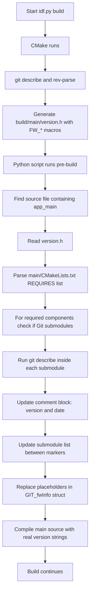

# Automatic Version Injection & Submodule Tracking for ESP‑IDF

This document describes the **fully automated versioning system** that keeps your ESP‑IDF project’s source code and documentation in sync with the actual Git state of the main repository and its submodules. The system runs a Python script **before every build** (triggered by CMake) and modifies the source file that contains `app_main` – no manual version edits are ever needed.

## Goals

- **No hardcoded versions** – firmware version, tag, commit hash, and build ID are taken directly from `git describe` at compile time.
- **Clean source code** – the source file contains readable placeholders like `"v0.0.0-0-dirty"` that are replaced automatically.
- **Submodule transparency** – the documentation header lists every required submodule with its exact tag/commit (from `git describe` inside the submodule).
- **Consistency** – the same version information is available both as a C++ struct (`GIT_fwInfo`) and in a human‑readable comment block.
- **Works regardless of file name** – the script finds the source file that contains `app_main` (the ESP‑IDF entry point), so it works with any naming convention.

## High‑Level Flow



## Detailed Functionality

### 1. Locating the Main Source File (`app_main`)
The script recursively searches `.cpp` and `.c` files for the string `app_main`. The first file that contains it is used for all modifications. This works regardless of whether the file is named `main.cpp`, `main.c`, `app_main.cpp`, etc.

### 2. Reading Version Information
The script reads the generated `build/main/version.h` (created by CMake) and extracts the following `FW_*` macros:

| Macro | Description | Example |
|-------|-------------|---------|
| `FW_GIT_VERSION` | Full `git describe` output | `v1.2.3-4-gabcd123-dirty` |
| `FW_GIT_TAG` | Tag name (or `"untagged"`) | `v1.2.3` |
| `FW_GIT_HASH` | Short hash with `g` prefix | `gabcd123` |
| `FW_FULL_HASH` | Full 40‑character hash | `abcd123…` |
| `FW_BUILD_ID` | Timestamp + short hash | `P20260508-134144-abc1234` |

### 3. Determining Used Submodules
The script parses `main/CMakeLists.txt` to obtain the `REQUIRES` list (e.g., `REQUIRES ED_WIFI ED_MQTT diag ED_S_JSON`).
For each required component, it checks `.gitmodules` to see if it is a registered submodule. If yes, it runs:

```bash
git -C components/<component_name> describe --tags --long --dirty --always
```

The output becomes the submodule’s version string (e.g., `v1.0.0-0-g2f08383`). Non‑submodule components (like local libraries) are ignored.

### 4. Updating the Source File (`app_main` location)

The script modifies the source file **in place** with three main operations:

#### a. Ensure a Documentation Block Exists
If the file has no `/** ... */` comment block, a default one is inserted at the top with placeholders for `@file`, `@brief`, `@author`, `@version`, `@date`, and the markers `@submodules-start` / `@submodules-end`.

#### b. Update Version and Date
- **`@version`** line is set to `@version GIT_VERSION: <FW_GIT_VERSION>`.
- **`@date`** line is set to the current date (YYYY‑MM‑DD).
- All other tags (`@file`, `@brief`, `@author`) are **preserved** exactly as written by the user.

#### c. Update the Submodule List
The script looks for lines containing `@submodules-start` and `@submodules-end`. Everything between these markers is replaced with a formatted list. For example, after a build the block may look like:

```
 * @submodules-start
 *   ED_WIFI : v1.0.0-0-g2f08383
 *   ED_MQTT : v1.1.0-4-gbc7c1c0-dirty
 * @submodules-end
```

Component names are left‑aligned (padded with spaces) for readability. If no submodules are used, the list shows `(none)`.

#### d. Replace Placeholders in the `GIT_fwInfo` Struct
The struct must be present in the same source file (usually after the comment block). It contains placeholder strings like:

```cpp
struct GIT_fwInfo {
    static constexpr const char* GIT_VERSION = "v0.0.0-0-dirty";
    static constexpr const char* GIT_TAG     = "untagged";
    static constexpr const char* GIT_HASH    = "g0000000";
    static constexpr const char* FULL_HASH   = "0000000000000000000000000000000000000000";
    static constexpr const char* BUILD_ID    = "P00000000-000000-0000000";
};
```

The script uses a regular expression to locate each line containing the field name and replaces the content **between the double quotes** with the corresponding value from `version.h`. The rest of the line (spacing, `*`, semicolon) stays unchanged.

## Integration with CMake

In the top‑level `CMakeLists.txt`, the following commands ensure the script runs **before** the main source file is compiled:

```cmake
find_package(Python3 REQUIRED)
add_custom_target(
    inject_version_before_build
    COMMAND ${Python3_EXECUTABLE} ${CMAKE_SOURCE_DIR}/tools/update_version_comment.py
    WORKING_DIRECTORY ${CMAKE_SOURCE_DIR}
    COMMENT "Injecting current git version into app_main source"
    VERBATIM
)
add_dependencies(${CMAKE_PROJECT_NAME}.elf inject_version_before_build)
```

## Expected Result After a Build

After `idf.py build`, the source file (the one with `app_main`) will contain:

```cpp
/**
 * @file main_mqtt_core.cpp
 * @brief MQTT over TLS client for ESP32 using custom ED_* libraries.
 *
 * @author Emanuele Dolis (edoliscom@gmail.com)
 * @version GIT_VERSION: v1.0.0-2-gabc123-dirty
 * @date 2026-05-08
 * @submodules-start
 *   ED_WIFI : v1.0.0-0-g2f08383
 *   ED_MQTT : v1.1.0-4-gbc7c1c0-dirty
 * @submodules-end
 */
...
struct GIT_fwInfo {
    static constexpr const char* GIT_VERSION = "v1.0.0-2-gabc123-dirty";
    static constexpr const char* GIT_TAG     = "v1.0.0";
    static constexpr const char* GIT_HASH    = "gabc123";
    static constexpr const char* FULL_HASH   = "abc123…";
    static constexpr const char* BUILD_ID    = "P20260508-134144-abc123";
};
```

## Troubleshooting

| Issue | Likely cause | Solution |
|-------|--------------|----------|
| `version.h not found` | CMake configuration not run | Run `idf.py reconfigure` first. |
| Submodule version shows `unknown` | Submodule not initialised or not a Git repo | Run `git submodule update --init --recursive`. |
| `@submodules-start` / `@submodules-end` markers missing | User has not placed them | Add the markers once; the script will maintain the content. |
| No changes made to the source file | File does not contain `app_main` or expected struct | Verify that the file with `app_main` contains the `GIT_fwInfo` struct and the comment markers. |

## Summary

This system provides a **fully automatic, version‑controlled** way to keep your source code documentation and version‑related struct in sync with your Git repository. It eliminates manual edits, reduces errors, and gives you an instant snapshot of the exact software state (including submodule revisions) every time you build.

The Python script is meant to be used inside an ESP‑IDF project but can be adapted to any CMake‑based embedded project with similar needs.

For the full conversation that led to this implementation, see:
[https://chat.deepseek.com/a/chat/s/23d38e69-d7f2-4a4a-94f7-7fa3c7ca75cf](https://chat.deepseek.com/a/chat/s/23d38e69-d7f2-4a4a-94f7-7fa3c7ca75cf)
```